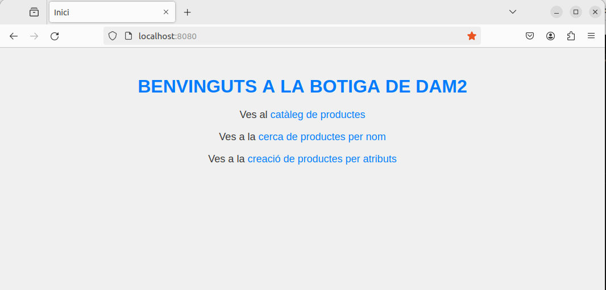
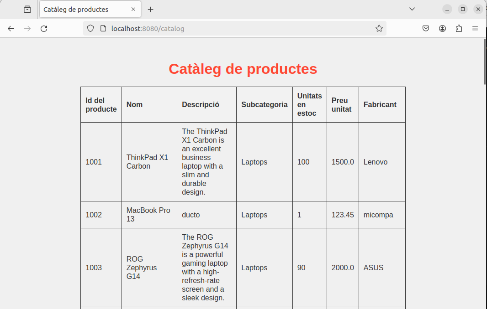
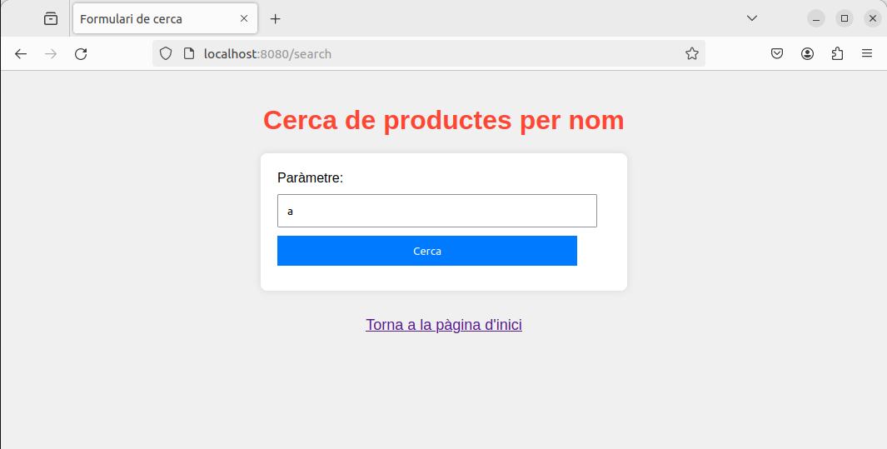
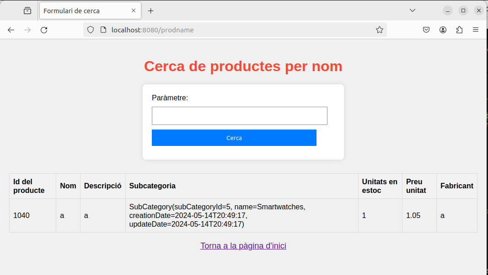
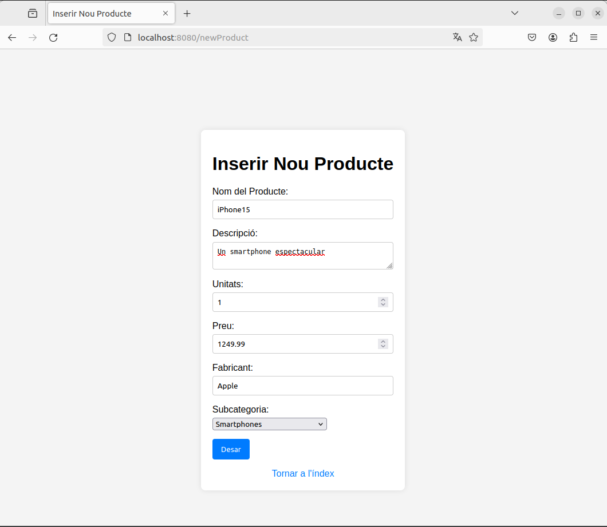
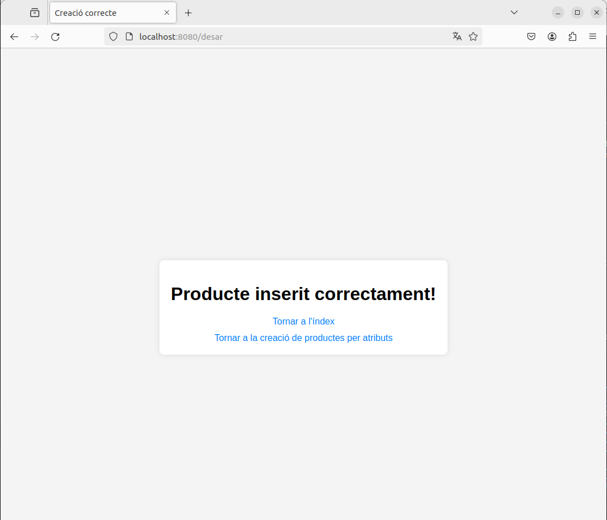

# M6_Uf4_P2

1. **Endpoint de índice ("/"):**
   Método: GET
   Función: Muestra la página de inicio de la aplicación.
   Vista: index.html
   

2. **Endpoint de catálogo ("/catalog"):**
   Método: GET
   Función: Muestra todos los productos disponibles en la base de datos.
   Acciones: Recupera todos los productos mediante productService.findAllProducts() y los añade al modelo.
   Vista: catalog.html
   

3. **Endpoint de búsqueda de productos por nombre ("/search" y "/prodname"):**
   Método: GET y POST
   Función: Busca un producto por su nombre y muestra sus atributos.
   Acciones: Si se proporciona un nombre, busca el producto correspondiente con productService.findProductsByName(name) y lo añade al modelo.
   Vista: search.html
   
   

4. **Endpoint para mostrar el formulario de creación de productos ("/newProduct"):**
   Método: GET
   Función: Muestra el formulario para la creación de un nuevo producto.
   Acciones: Recupera todas las subcategorías mediante subCategoryService.findAllSubCategories() y las añade al modelo. También crea un objeto Product vacío y lo añade al modelo.
   Vista: productcreation.html
   

5. **Endpoint para guardar un producto ("/desar"):**
   Método: POST
   Función: Guarda el producto creado y lleva al usuario a la página de confirmación.
   Acciones: Guarda el producto proporcionado mediante productService.saveProduct(product).
   Vista: productcreationsuccess.html
   
